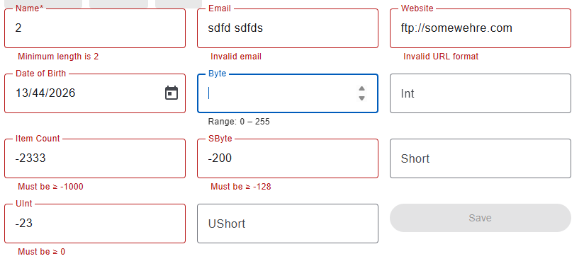

# Automate Your Full-stack Development on ASP.NET Core Web API and Angular With Code Generator and  AI Code Agent

## User Story

As a full stack software developer, after developing ASP.NET Web API with data validations in the Web API bindings, I would like the SPA on Angular framework to have client side validations to reduce round trips of related data error and improve user experience.

## Functional requirements.

1. When user input invalid data, the GUI should respond with warning or error message.
2. Invalid data cannot be submitted to the backend.

## Technical requirements

1. Strictly typed reactive forms.
2. Use built-in validators along with FormControl.
3. Develop custom validators if necessarily.
4. Look for 3rd party solutions including AI code agent before hand-crafting codes. For example, the 3rd party code generator or AI should transform some validation attributes of .NET to validators of Angular.
5. For numeric .NET types like byte, integer, uint, and int64 etc., the client side validations should be applied.

## Backend with .NET Integral Types and Validation Attributes

POCO Class and API function:
```cs
	public class IntegralEntity
	{
		public sbyte SByte { get; set; }

		public byte Byte { get; set; }

		public short Short { get; set; }

		public ushort UShort { get; set; }

		public int Int { get; set; }

		public uint UInt { get; set; }

		[Range(-1000, 1000000)]
		public int ItemCount { get; set; }
	}

	public class MixedDataEntity : IntegralEntity
	{
		public DateOnly DOB { get; set; }

		[System.ComponentModel.DataAnnotations.Required]//MVC and Web API care about only this
		[MinLength(2), MaxLength(255)]
		public string Name { get; set; }

		[RegularExpression(@"^(https?:\/\/)?[da-z.-]+.[a-z.]{2,6}([/\w .-]*)*\/?$")]
		public Uri Web { get; set; }

		[EmailAddress, MaxLength(255)]
		public string EmailAddress { get; set; }
	}

		[HttpPost("MixedDataEntity")]
		public MixedDataEntity PostMixedDataEntity([FromBody] MixedDataEntity entity)
		{
			return entity;
		}
```


## Generate TypeScript Code for Angular Reactive Forms

Utilize [WebApiClientGen](https://github.com/zijianhuang/webapiclientgen?tab=readme-ov-file#seamless-development-of-aspnet-core-web-api-and-client-programs), with plugin  "[Fonlow.WebApiClientGenCore.NG2FormGroup](https://www.nuget.org/packages/Fonlow.WebApiClientGenCore.NG2FormGroup/)".

## Application Programming with Generated Code
Generated TypeScript code:
```ts
	export interface IntegralEntity {

		/** Type: byte, 0 to 255 */
		byte?: number | null;

		/** Type: int, -2,147,483,648 to 2,147,483,647 */
		int?: number | null;

		/**
		 * Type: int
		 * Range: inclusive between -1000 and 1000000
		 */
		itemCount?: number | null;

		/** Type: sbyte, -128 to 127 */
		sByte?: number | null;

		/** Type: short, -32,768 to 32,767 */
		short?: number | null;

		/** Type: uint, 0 to 4,294,967,295 */
		uInt?: number | null;

		/** Type: ushort, 0 to 65,535 */
		uShort?: number | null;
	}
	export function CreateIntegralEntityFormGroup() {
		return new FormGroup({
			byte: new FormControl<number | null | undefined>(undefined, [Validators.min(0), Validators.max(255)]),
			int: new FormControl<number | null | undefined>(undefined, [Validators.min(-2147483648), Validators.max(2147483647)]),
			itemCount: new FormControl<number | null | undefined>(undefined, [Validators.min(-1000), Validators.max(1000000)]),
			sByte: new FormControl<number | null | undefined>(undefined, [Validators.min(-128), Validators.max(127)]),
			short: new FormControl<number | null | undefined>(undefined, [Validators.min(-32768), Validators.max(32767)]),
			uInt: new FormControl<number | null | undefined>(undefined, [Validators.min(0), Validators.max(4294967295)]),
			uShort: new FormControl<number | null | undefined>(undefined, [Validators.min(0), Validators.max(65535)]),
		});

	}

	export interface MixedDataEntity extends DemoWebApi_DemoData_Client.IntegralEntity {

		/** Type: DateOnly */
		dob?: Date | null;

		/** Max length: 255 */
		emailAddress?: string | null;

		/**
		 * Required. Null or empty is invalid.
		 * Min length: 2
		 * Max length: 255
		 */
		name: string;

		/**
		 * Type: Uri
		 * Regex pattern: ^(https?:\\/\\/)?[da-z.-]+.[a-z.]\{2,6\}([\/\w .-]\*)\*\\/?$
		 */
		web?: string | null;
	}
	export function CreateMixedDataEntityFormGroup() {
		return new FormGroup({
			byte: new FormControl<number | null | undefined>(undefined, [Validators.min(0), Validators.max(255)]),
			int: new FormControl<number | null | undefined>(undefined, [Validators.min(-2147483648), Validators.max(2147483647)]),
			itemCount: new FormControl<number | null | undefined>(undefined, [Validators.min(-1000), Validators.max(1000000)]),
			sByte: new FormControl<number | null | undefined>(undefined, [Validators.min(-128), Validators.max(127)]),
			short: new FormControl<number | null | undefined>(undefined, [Validators.min(-32768), Validators.max(32767)]),
			uInt: new FormControl<number | null | undefined>(undefined, [Validators.min(0), Validators.max(4294967295)]),
			uShort: new FormControl<number | null | undefined>(undefined, [Validators.min(0), Validators.max(65535)]),
			dob: CreateDateOnlyFormControl(),
			emailAddress: new FormControl<string | null | undefined>(undefined, [Validators.email, Validators.maxLength(255)]),
			name: new FormControl<string | null>(null, [Validators.required, Validators.minLength(2), Validators.maxLength(255)]),
			web: new FormControl<string | null | undefined>(undefined, [Validators.pattern(/^(https?:\/\/)?[da-z.-]+.[a-z.]{2,6}([/\w .-]*)*\/?$/)]),
		});

	}

		/**
		 * POST api/Entities/MixedDataEntity
		 */
		postMixedDataEntity(entity?: DemoWebApi_DemoData_Client.MixedDataEntity | null, headersHandler?: () => HttpHeaders): Observable<DemoWebApi_DemoData_Client.MixedDataEntity> {
			return this.http.post<DemoWebApi_DemoData_Client.MixedDataEntity>(this.baseUri + 'api/Entities/MixedDataEntity', JSON.stringify(entity), { headers: headersHandler ? headersHandler().append('Content-Type', 'application/json;charset=UTF-8') : new HttpHeaders({ 'Content-Type': 'application/json;charset=UTF-8' }) });
		}
```

## Create Data Edit Form Through ChatGPT

It is the normal ChatGPT, while you are welcome to try Plus, Codex, or Claude AI etc. And I gave the following prompt:

### Prompt

For Angular Reactive Forms programming of Angular 21 along with Angular Material Components, I have the following TypeScript codes about the data models and FormGroup declarations:
```
...The ts code block above except the generated client API POST call...
...
```
and I would like you to:
1. Craft a data entry component for data fields of data model `MixedDataEntity`, with FormGroup object created by CreateMixedDataEntityFormGroup(), and the expect output is data-detail.component.ts and data-detail.component.html
2. The HTML template are composed with matFormField and matInput and formControlName etc.
3. MatHint of each FormField hints about data constraints.
4. Only when the matInput gets focused, the matHint is shown.
5. MatError for showing validation errors
6. Use `@if` instead of `*ngIf`.

### Generated Component

1. [data-detail.component.ts](https://github.com/zijianhuang/DemoCoreWeb/tree/master/AngularHeroes/src/app/data-detail/data-detail.component.ts)
2. [data-detail.component.html](https://github.com/zijianhuang/DemoCoreWeb/tree/master/AngularHeroes/src/app/data-detail/data-detail.component.html)

With minor modification, I get the following:



# Compare with Other AI Code Agents

Please check the [online demo](https://zijianhuang.github.io/DemoCoreWeb/angular).

## Through ChatGPT Codex

I use the Codex extension of Visual Studio Code.

1. [codex-detail.component.ts](https://github.com/zijianhuang/DemoCoreWeb/tree/master/AngularHeroes/src/app/codex-detail/codex-detail.component.ts)
2. [codex-detail.component.html](https://github.com/zijianhuang/DemoCoreWeb/tree/master/AngularHeroes/src/app/codex-detail/codex-detail.component.html)

Codex is surely smarter than generic ChatGPT, especially when it is integrated with Visual Studio Code, at least for better Developer Experience.

1. Rather the inlining error messages in the HTML template, the code agent aggregates error messages into the TS file. And Codex "understands" how Angular FormControl and Validators work, and minimize the code footprint through utilizing the error output of Angular validators.
2. The standalone component has proper imports of modules needed.

## Through Claude.ai

1. [data-detail.component.ts](./claude/data-detail.component.ts)
2. [data-detail.component.html](./claude/data-detail.component.html)

Claude.ai is as smart as Codex, however, the code generated is too verbose, and its practice of defensive programming is over diligent.

HTML by generic ChatGPT:
```html
  <mat-form-field appearance="outline">
    <mat-label>Name</mat-label>

    <input matInput formControlName="name"
           (focus)="onFocus('name')" (blur)="onBlur()" />

    @if (focused === 'name') {
      <mat-hint>Required • 2–255 characters</mat-hint>
    }

    @if (form.controls.name.errors && form.controls.name.touched) {
      <mat-error>
        @if (form.controls.name.errors['required']) { Name is required }
        @if (form.controls.name.errors['minlength']) { Minimum length is 2 }
        @if (form.controls.name.errors['maxlength']) { Maximum length is 255 }
      </mat-error>
    }
  </mat-form-field>
  ```

  HTML generated by Claude.ai:
  ```html
     <mat-form-field appearance="outline" class="full-width">
        <mat-label>Name</mat-label>
        <input matInput
               formControlName="name"
               placeholder="Full name"
               (focus)="onFocus('name')"
               (blur)="onBlur()" />
        @if (focusedField === 'name') {
          <mat-hint>Required · 2–255 characters</mat-hint>
        }
        @if (form.get('name')?.hasError('required')) {
          <mat-error>Name is required.</mat-error>
        }
        @if (form.get('name')?.hasError('minlength')) {
          <mat-error>At least 2 characters required.</mat-error>
        }
        @if (form.get('name')?.hasError('maxlength')) {
          <mat-error>Maximum 255 characters allowed.</mat-error>
        }
      </mat-form-field>
  ```

For displaying errors of multiple constraints, the code generated by ChatGPT is more compact. Also, ChatGPT recognizes that the FormGroup TypeScript codes included in the prompt provides strictly typed data with `form.controls.name` already assure form control `name` is there. There's no need to have a guesswork and safety net like `form.get('name')?`.

Nevertheless, this does not mean Claude.ai is overall worse than ChatGTP. It might just happen that Claude.ai is not very good in crafting Angular code, or the default settings need to be adjusted through prompt.

## Common Behavior

Without explicitly prompting "Use `@if` instead of `*ngIf`", they all use `*ngIf` in the HTML template. Apparently the training of these AI agents was mostly done before Angular 17.

# How About Generate GUI Directly From Backend Code?

Previously, I have used [WebApiClientGen](https://github.com/zijianhuang/webapiclientgen) generated TypeScript code as part of the prompt for AI code agents to create the data‑entry component. You may be asking: why not just use the backend POCO classes as part of the prompt?

And I have tried:

## Prompt

For Angular Reactive Forms programming of Angular 21 along with Angular Material Components, I have already the following .NET POCO classes codes about the data models:
```cs
	public class IntegralEntity
	{
		public sbyte SByte { get; set; }

		public byte Byte { get; set; }
...
		[RegularExpression(@"^(https?:\/\/)?[da-z.-]+.[a-z.]{2,6}([/\w .-]*)*\/?$")]
		public Uri Web { get; set; }

		public string EmailAddress { get; set; }
	}

```

and I would like you to:
0. Declare TypeScript interfaces for POCO classes, and strictly typed FormGroup codes which include Angular validators mapping to .NET numeric types and validation attributes.
1. Craft a data entry component for data fields of data model `MixedDataEntity`, and the expect output is data-detail.component.ts and data-detail.component.html
2. The HTML template are composed with matFormField and matInput and formControlName etc.
3. MatHint of each FormField hints about data constraints.
4. Only when the matInput gets focused, the matHint is shown.
5. MatError for showing validation errors
6. Use `@if` instead of `*ngIf`.

## AI Generated Code

I have tried with ChatGPT normal, and Claud.ai. You may try with similar prompt with various AI code agents.

So far I see the component generated by ChatGPT is slightly more verbose than the one based on the prompt containing TypeScript code generated.
And the one generated by Claude.ai is much more verbose and complex -- more complex design with much lengthier code.

## Summary

After these experiments, I would prefer to use a traditional code generator to produce TypeScript code first, and then ask AI to generate the data‑entry form. My reasons are:

1.  The output of a traditional code generator is predictable, deterministic and the least verbose.
1.  I shouldn't be expected to manually adjust and maintain the generated code by traditional codegen.
1.  Even though the data‑entry form is generated by AI, it is still faster to adjust it manually than to write prompts asking the AI to refine it.
1. The more tasks/steps in the AI context window, the more likely the AI generates more complex design and longer code, and the more likely the data entry form contains more unnecessary technical details / wastes.

Both traditional code generators and AI code agents are opinionated, while you may ask AI code generates to changed to the other opinionated approaches. 

When building complex business applications using libraries, frameworks, code generators, and AI code agents:
* Where is the balance? 
* How do we define that balance among various opinionated approaches?


