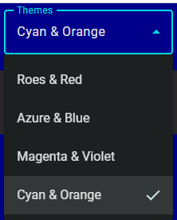
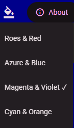
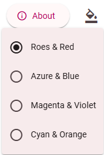

# Web Theme Loader with Comprehensive Features and Minimum API Surface

You can use this simple, powerful and flexible Web theme loader in your Web app especially SPA+PWA to realize similar UX as seen in these prominent sites:
1. [Angular Material Doc](https://material.angular.dev/)
2. [PrimeNG](https://primeng.org/)
3. [PrimeVue](https://primevue.org/)
4. [DaisyUI](https://daisyui.com/)

### Web Sites and Apps that Use This ThemeLoader

* [Angular Material Components Extension](https://zijianhuang.github.io/nmce/en/)
* [JsonToTable](https://zijianhuang.github.io/json2table/)
* [Personal Blog](https://zijianhuang.github.io/poets)
* [Angular Heroes](https://zijianhuang.github.io/DemoCoreWeb/angular/dashboard), and [Sourcecode](https://github.com/zijianhuang/DemoCoreWeb/tree/master/AngularHeroes)
* [React Heroes](https://zijianhuang.github.io/DemoCoreWeb/react/) and [Sourcecode](https://github.com/zijianhuang/DemoCoreWeb/tree/master/ReactHeroes)



## Summary

The [Web theme loader API](https://github.com/zijianhuang/nmce/blob/master/projects/demoapp/src/app/themeLoader.ts) exposes 3 contracts:
1. `static init()` of themeLoader to be called during app startup.
2. `static loadTheme(picked: string | null, appColorsDir?: string | null)` to be called when the app user picks one from available themes.
3. `static get selectedTheme(): string | null` of themeLoader to give the URL of the selected theme, so GUI may display which theme is in-use.

Because the theme should be loaded at startup before the Web app rendering, the respective config should be loaded synchronously ASAP. The recommended implementation is to use JavaScript constant SITE_CONFIG that contains a theme dictionary and app specific theme settings.

The GUI of theme selection is independent of the Web theme loader API.

## Installation
1. Add [themeLoader.ts](https://github.com/zijianhuang/nmce/blob/master/projects/demoapp/src/app/themeLoader.ts)
2. Add data schema [`themeDef.ts`](https://github.com/zijianhuang/nmce/blob/master/projects/demoapp/src/environments/themeDef.ts) for the themes dictionary in `siteconfig.js`, along with [`environment.common.ts`](https://github.com/zijianhuang/nmce/blob/master/projects/demoapp/src/environments/environment.common.ts) for strongly typed site config during Web app startup.

## Integration
1. Call `ThemeLoader.loadTheme()` before the [bootstrap of the Web app](https://github.com/zijianhuang/nmce/blob/master/projects/demoapp/src/main.ts).
1. In the [UI component presenting the theme picker](https://github.com/zijianhuang/nmce/blob/master/projects/demoapp/src/app/app.component.ts), convert the themes dictionary to an array which will be used to present the list. And call `ThemeLoader.loadTheme()` when the picker picks a theme.
1. Prepare [`siteconfig.js`](https://github.com/zijianhuang/nmce/blob/master/projects/demoapp/src/conf/siteconfig.js) and add `<script src="conf/siteconfig.js"></script>` to [index.html](https://github.com/zijianhuang/nmce/blob/master/projects/demoapp/src/index.html) if you want flexibility after build and deployment. Or, simply provide constant SITE_CONFIG in app codes.

### [Angular Example](https://github.com/zijianhuang/DemoCoreWeb/blob/master/AngularHeroes/)

 [main.ts](https://github.com/zijianhuang/DemoCoreWeb/blob/master/AngularHeroes/src/main.ts)
 ```ts
ThemeLoader.init();
bootstrapApplication(AppComponent, appConfig); 
```

[theme-select.component.ts](https://github.com/zijianhuang/DemoCoreWeb/blob/master/AngularHeroes/src/app/theme-select.component.ts)
```ts
	constructor() {
		this.themes = AppConfigConstants.themesDic ? Object.keys(AppConfigConstants.themesDic).map(k => {
			const c = AppConfigConstants.themesDic![k];
			const obj: ThemeDef = {
				display: c.display,
				filePath: k,
				dark: c.dark
			};
			return obj;
		}) : undefined;
	}

	themeSelectionChang(e: MatSelectChange) {
		ThemeLoader.loadTheme(e.value);
	}
```

[theme-select.component.html](https://github.com/zijianhuang/DemoCoreWeb/blob/master/AngularHeroes/src/app/theme-select.component.html)
```html
<mat-select #themeSelect (selectionChange)="themeSelectionChang($event)" [value]="currentTheme">
	@for (item of themes; track $index) {
	<mat-option [value]="item.filePath">{{item.display}}</mat-option>
	}
</mat-select>
```

[siteconfig.js](https://github.com/zijianhuang/DemoCoreWeb/blob/master/docs/angular/conf/siteconfig.js)
```js
const SITE_CONFIG = {
	apiBaseUri: 'https://mybackend.com/',
	themesDic: {
		"assets/themes/azure-blue.css": { display: "Azure & Blue", dark: false },
		"assets/themes/rose-red.css": { display: "Roes & Red", dark: false },
		"assets/themes/magenta-violet.css": { display: "Magenta & Violet", dark: true },
		"assets/themes/cyan-orange.css": { display: "Cyan & Orange", dark: true }
	},
	themeLoaderSettings: {
		storageKey: 'app.theme',
		themeLinkId: 'theme',
		appColorsDir: 'conf/',
		appColorsLinkId: 'app-colors',
		colorsCss: 'colors.css',
		colorsDarkCss: 'colors-dark.css'
	}
}
```

[index.html](https://github.com/zijianhuang/DemoCoreWeb/blob/master/AngularHeroes/src/index.html)
```html
    <script src="conf/siteconfig.js"></script>
</head>
```

### React Example

[index.tsx](https://github.com/zijianhuang/DemoCoreWeb/blob/master/ReactHeroes/src/index.tsx)
```ts
ThemeLoader.init();

const root = ReactDOM.createRoot(
  document.getElementById('root') as HTMLElement
);
root.render(...
```

[Home.tsx](https://github.com/zijianhuang/DemoCoreWeb/blob/master/ReactHeroes/src/Home.tsx)
```ts
	const themes = AppConfigConstants.themesDic ? Object.keys(AppConfigConstants.themesDic).map(k => {
		const c = AppConfigConstants.themesDic![k];
		const obj: ThemeDef = {
			display: c.display,
			filePath: k,
			dark: c.dark
		};
		return obj;
	}) : undefined;

	const [currentTheme, setCurrentTheme] = useState(() => ThemeLoader.selectedTheme ?? undefined);
	const handleChange = (event: React.ChangeEvent<HTMLSelectElement>) => {
		const v = event.target.value;
		setCurrentTheme(v);
		ThemeLoader.loadTheme(v);
	};

	return (
		<>
			<h1>React Heroes!</h1>
			<div>
				<label htmlFor="theme-select">Themes </label>
				<select
					id="theme-select"
					value={currentTheme ?? ""}
					onChange={handleChange}
				>
					{themes?.map((item) => (
						<option key={item.filePath} value={item.filePath}>
							{item.display}
						</option>
					))}
				</select>
			</div>
```

[siteconfig.js](https://github.com/zijianhuang/DemoCoreWeb/blob/master/docs/react/conf/siteconfig.js)
```js
const SITE_CONFIG = {
	apiBaseUri: 'https://mybackend.com/',
	themesDic: {
		"assets/themes/azure-blue.css": { display: "Azure & Blue", dark: false },
		"assets/themes/rose-red.css": { display: "Roes & Red", dark: false },
		"assets/themes/magenta-violet.css": { display: "Magenta & Violet", dark: true },
		"assets/themes/cyan-orange.css": { display: "Cyan & Orange", dark: true }
	},
	themeLoaderSettings: {
		storageKey: 'app.theme',
		themeLinkId: 'theme',
		appColorsDir: 'conf/',
		appColorsLinkId: 'app-colors',
		colorsCss: 'colors.css',
		colorsDarkCss: 'colors-dark.css'
	}
}
```

[index.html](https://github.com/zijianhuang/DemoCoreWeb/blob/master/ReactHeroes/public/index.html)
```html
    <script src="conf/siteconfig.js"></script>
</head>
```

