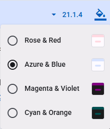
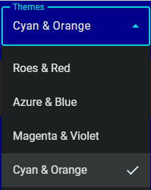

# Web Theme Loader in TypeScript with Minimum API Surface

When users use my Angular apps, they shall be able to select a theme from a theme list, some of which are dark.

If you google `JavaScript theme loader`, you may find many articles and example codes. And Google AI and Copilot and alike may generate fairly decent codes, as many JavaScript programmers have crafted many for over 2 decades.

I have crafted one from scratch based on specific functional requirements and technical requirements, conforming to my design principles for UI, UX and Developer Experience.

## Requirements

### User Story

As a web app user, I want to choose from multiple available themes — sometimes light, other times dark.

### Work Order

Develop a TypeScript-based API that provides helper functions or classes for building a theme picker in web applications. The API should be framework‑agnostic, while optionally offering convenient integration points for Angular applications.

### Functional Requirements
1. Support both light and dark themes.  
2. Support more than two themes — at least three themes must be available.  
3. Support commonly used prebuilt themes, optionally combined with an app‑specific color stylesheet such as `colors.css`, with an optional dark‑mode variant like `colors-dark.css`.  
4. Support dynamic switching between themes at runtime.  
5. When the same web app/site is opened in another browser tab, the explicitly selected theme should be preserved and applied.

### Technical Requirements
1. Reusable across multiple applications.  
2. Minimal API surface to ensure easy customization and easy usage.  
3. Neutral with respect to specific UI design choices.  
4. Must be efficient and avoid visual flicker during startup and theme switching.  
5. Usable in both SPA and PWA.  
6. Fully functional in PWAs, offline usage, and intranet environments.  
7. Adjustable after build, bundling, and deployment. For example, an admin should be able to change the number and order of available themes, and modify app‑specific color files.  
8. Themes may be hosted locally or on a CDN.  
9. Selecting a theme that is already loaded should not trigger a reload of the theme.  
10. Core theme management must be separated from the theme‑picker UI.

### Examples in the real world:
1. [Angular Material Doc](https://material.angular.dev/)
2. [PrimeNG](https://primeng.org/)
3. [PrimeVue](https://primevue.org/)
4. [DaisyUI](https://daisyui.com/)


 ** If you find your requirements match mine, please read on.**

 The following sourcecode is crafted in TypeScript for Angular SPA, and it should be easy to use in other Web apps or sites crafted in JavaScript, with little modification.

 ## Theme Loader

themeLoader.ts ([full sourcecode](https://github.com/zijianhuang/nmce/blob/master/projects/demoapp/src/app/themeLoader.ts))
 ```ts
export class ThemeLoader {
	private static readonly settings = AppConfigConstants.themeLoaderSettings;

	/**
	 * selected theme file name saved in localStorage.
	 */
	static get selectedTheme(): string | null {
		return this.settings ? localStorage.getItem(this.settings.storageKey) : null;
	};
	private static set selectedTheme(v: string) {
		if (this.settings) {
			localStorage.setItem(this.settings.storageKey, v);
		}
	};

	/**
	 * Load theme during app startup or operation.
	 * @param picked one of the prebuilt themes, typically used with the app's theme picker.
	 * or null for the first one in themesDic, typically used before calling `bootstrapApplication()`.
	 */
	static loadTheme(picked: string | null) {
		if (!AppConfigConstants.themesDic || !this.settings || Object.keys(AppConfigConstants.themesDic).length === 0) {
			console.error('AppConfigConstants need to have themesDic with at least 1 item, and themeKeys.');
			return;
		}

		let themeLink = document.getElementById(this.settings.themeLinkId) as HTMLLinkElement;
		if (themeLink) { // app has been loaded in the browser page/tab.
			const currentTheme = themeLink.href.substring(themeLink.href.lastIndexOf('/') + 1);
			const notToLoad = picked == currentTheme;
			if (notToLoad) {
				return;
			}

			const themeValue = AppConfigConstants.themesDic[picked!];
			if (!themeValue) {
				return;
			}

			themeLink.href = picked!;
			this.selectedTheme = picked!;
			console.info(`theme altered to ${picked}.`);

			if (this.settings.appColorsLinkId) {
				let appColorsLink = document.getElementById(this.settings.appColorsLinkId) as HTMLLinkElement;
				if (appColorsLink) {
					if (themeValue.dark != null && this.settings.colorsDarkCss && this.settings.colorsCss) {
						const customFile = themeValue.dark ? this.settings.colorsDarkCss : this.settings.colorsCss;
						appColorsLink.href = (this.settings.appColorsDir ?? '') + customFile;
					} else if (this.settings.colorsCss) {
						appColorsLink.href = (this.settings.appColorsDir ?? '') + this.settings.colorsCss;
					}
				}
			}
		} else { // when app is loaded for the first time, then create 
			themeLink = document.createElement('link');
			themeLink.id = this.settings.themeLinkId;
			themeLink.rel = 'stylesheet';
			const themeDicKey = picked ?? Object.keys(AppConfigConstants.themesDic!)[0];
			themeLink.href = themeDicKey;
			document.head.appendChild(themeLink);
			this.selectedTheme = themeDicKey;
			console.info(`Initially loaded theme ${themeDicKey}`);

			if (this.settings.appColorsLinkId) {
				const appColorsLink = document.createElement('link');
				appColorsLink.id = this.settings.appColorsLinkId;
				appColorsLink.rel = 'stylesheet';
				const themeValue = AppConfigConstants.themesDic[themeDicKey];
				if (themeValue.dark != null && this.settings.colorsDarkCss && this.settings.colorsCss) {
					const customFile = themeValue.dark ? this.settings.colorsDarkCss : this.settings.colorsCss;
					appColorsLink.href = (this.settings.appColorsDir ?? '') + customFile;
				} else if (this.settings.colorsCss) {
					appColorsLink.href = (this.settings.appColorsDir ?? '') + this.settings.colorsCss;
				}

				if (appColorsLink.href) {
					document.head.appendChild(appColorsLink);
					console.info(`appColors ${appColorsLink} loaded.`)
				} else {
					console.warn(`With appColorsLinkId defined, dark&colorsCss&colorDarkCss or colorsCss should be defined.`)
				}
			}
		}
	}
}
 ```

### Configuration

Typically an Web app with JavaScript has some settings that should be loaded at the very beginning synchronously.

Data schema ([full sourcecode](https://github.com/zijianhuang/nmce/blob/master/projects/demoapp/src/environments/themeDef.ts)):
```ts
export interface ThemeValue {
	/** Display name */
	display: string;

	/** Dark them or not. Optionally to tell which optional app level colors CSS to use, if some app level colors need to adapt the light or dark theme. */
	dark?: boolean;
}

export interface ThemeDef extends ThemeValue {
	/** Relative path or URL to CDN */
	filePath: string;
}

export interface ThemesDic {
	[filePath: string]: ThemeValue
}

export interface ThemeLoaderMeta {
	storageKey: string;
	themeLinkId: string;

	/** 
	 * Optionally the app may has an app level colors CSS declaring colors neutral to the light or dark theme, in addition to a prebuilt theme
	 * If some colors need to adapt the light or dark theme, having those colors defined in colorsCss and colorsDarkCss is convenient for SDLC, since you can
	 * use tools to flip colors to dark or light.
	 */
	appColorsLinkId?: string;

	/**
	 * If undefined or null, app colors css is in root.
	 * Effected only when appColorsLinkId is defined.
	 */
	appColorsDir?: string;

	/** 
	 * Optionally the app may has an app level colors CSS declaring colors adapting to the light theme. 
	 * If the app uses only light or dark theme, for example ThemeValue.dark is not defined, this alone is enough, not needing colorsDarkCss. 
	*/
	colorsCss?: string;

	/** 
	 * Optionally the app may has an app level colors CSS declaring colors adapting to the dark theme. 
	 * If the app uses only light or dark theme, there's no need to declare this. 
	 */
	colorsDarkCss?: string;
}
```

siteconfig.js:
```js
const SITE_CONFIG = {
	themesDic: {
		"assets/themes/rose-red.css":{display: "Roes & Red", dark:false},
		"assets/themes/azure-blue.css":{display: "Azure & Blue", dark:false},
		"assets/themes/magenta-violet.css":{display: "Magenta & Violet", dark:true},
		"assets/themes/cyan-orange.css":{display: "Cyan & Orange", dark:true}
	},
	themeLoaderSettings: {
		storageKey: 'app.theme',
		themeLinkId: 'theme',
		appColorsDir: 'conf/',
		appColorsLinkId: 'app-colors',
		colorsCss: 'colors.css',
		colorsDarkCss: 'colors-dark.css'
	}
}
```
Hints:
* Theme filename can be URL to CDN.
* When the Website or app is launched for the first time, the top one in themesDic is the default.

index.html ([full sourcecode](https://github.com/zijianhuang/nmce/blob/master/projects/demoapp/src/index.html)):
```html
...
<body>
	<script src="conf/siteconfig.js"></script>
    ...
```

### Startup
 To ensure Angular runtime to utilize the theme as early as possible before rendering any component, ThemeLoader must be called before bootstrap:

 main.ts
 ```ts
ThemeLoader.loadTheme(ThemeLoader.selectedTheme);
bootstrapApplication(AppComponent, appConfig); 
```

### UI for Switching Theme

Typically the UI of switching between themes is a dropdown implemented using something like [MatMenu](https://material.angular.dev/components/menu/overview) or [MatSelect](https://material.angular.dev/components/select/overview), while there are Websites for graphic designers coming with complex runtime styles and theme selection UI, like what in PrimeVue. However, I would doubt any business app or consumer app would favor such powerful complexity.

 

 

HTML with MatSelect:
```html
  <mat-form-field>
    <mat-label i18n>Themes</mat-label>
    <mat-select #themeSelect (selectionChange)="themeSelectionChang($event)" [value]="currentTheme">
      @for (item of themes; track $index) {
      <mat-option [value]="item.fileName">{{item.name}}</mat-option>
      }
    </mat-select>
  </mat-form-field>
```

Code behind ([full codes](https://github.com/zijianhuang/nmce/blob/master/projects/demoapp/src/app/app.component.ts)):
```ts
  themes?: ThemeDef[];

  currentTheme: string | null;
  ...
    this.themes = AppConfigConstants.themesDic ? Object.keys(AppConfigConstants.themesDic).map(k => {
      const c = AppConfigConstants.themesDic![k];
      const obj: ThemeDef = {
        name: c.name,
        fileName: k,
        dark: c.dark
      };
      return obj;
    }) : undefined;
...
  themeSelectionChang(e: MatSelectChange) {
    ThemeLoader.loadTheme(e.value);
  }
```

## Summary

The API exposes 3 contracts:
1. `static loadTheme(picked: string | null, appColorsDir?: string | null)` of themeLoader to be called during startup, and when the app user picks one from available themes.
2. `static get selectedTheme(): string | null` of themeLoader.
3. JavaScript constant SITE_CONFIG that contains a theme dictionary.

### Installation and Integration
1. Add [themeLoader.ts](https://github.com/zijianhuang/nmce/blob/master/projects/demoapp/src/app/themeLoader.ts)
2. Add data schema [`themeDef.ts`](https://github.com/zijianhuang/nmce/blob/master/projects/demoapp/src/environments/themeDef.ts) for the themes dictionary in `siteconfig.js`, along with [`environment.common.ts`](https://github.com/zijianhuang/nmce/blob/master/projects/demoapp/src/environments/environment.common.ts) for strongly typed site config during Web app startup.
3. Call `ThemeLoader.loadTheme()` before the [bootstrap of the Web app](https://github.com/zijianhuang/nmce/blob/master/projects/demoapp/src/main.ts).
4. In the [UI component presenting the theme picker](https://github.com/zijianhuang/nmce/blob/master/projects/demoapp/src/app/app.component.ts), convert the themes dictionary to an array which will be used to present the list. And call `ThemeLoader.loadTheme()` when the picker picks a theme.
5. Prepare [`siteconfig.js`](https://github.com/zijianhuang/nmce/blob/master/projects/demoapp/src/conf/siteconfig.js).
6. In [index.html](https://github.com/zijianhuang/nmce/blob/master/projects/demoapp/src/index.html), add `<script src="conf/siteconfig.js"></script>` .

Remarks:
* Interfaces defined in `themeDef.ts` and `environment.common.ts` won't be built into JavaScript, therefore they are not part of the API

### Web Sites and Apps that Use This ThemeLoader

* [Angular Material Components Extension](https://zijianhuang.github.io/nmce/en/)
* [JsonToTable](https://zijianhuang.github.io/json2table/)
* [Personal Blog](https://zijianhuang.github.io/poets)

## Alternative Implementation by Angular Material Documentation

After Angular Material Components v12, the documentation site has been merged into the components' repository.

Please check https://github.com/angular/components/blob/main/docs/src/app/shared/theme-picker/ and https://github.com/angular/material.angular.io/blob/main/src/app/shared/style-manager/ . 

The design basically conforms to the "Requirements" above, though more complex and comprehensive in the contexts of the documentation site, and within its business scope. Overall, decent and elegant enough.

And likely, the design and the implementation have inspired many LLMs based AI code generators.

## Alternative Designs by AI Code Generators

Using the requirements above as prompt, I asked Windows Copilot to generate sourcecode, then  asked M365 Copilot of another account, and the Claude.AI etc.

1. [Web Theme Loader Generated by Windows Copilot](../Web%20Theme%20Loader%20by%20Windows%20Copilot/)
1. [Web Theme Loader Generated by M365 Copilot](../Web%20Theme%20Loader%20by%20M365%20Copilot/)
1. [Web Theme Loader Generated by ClaudeAi](../Web%20Theme%20Loader%20by%20ClaudeAi/)


# My Take on AI Code Generators

For almost a year, since early 2025, I have been using Windows Copilot and M365 Copilot to help my daily programming works, mostly trivial works, and occasionally heavy scaffolding, covering these areas:
1. Simple data transformation, such as JSON data to CSV.
2. Common algorithms.
3. Common code snippets.
4. Craft CSS, or create dark theme based on existing CSS.
5. Sample codes regarding some details of frameworks and libraries that I am not familiar with or forget.
6. Scaffold codes for synchronizing data sets, for example, sync the customers of ErpNext to contacts of QuickBook. 
7. ...

I feel pleased, relax and productive with such junior programmer helping me, releasing me from trivial and repetitive technical details.

The attempts above asking AI to generate a theme loader is to have more hand-on experience in using AI in other areas. I will be writing a series of articles about how AI could help senior developers, the inherent shortfalls of AI code generators and why such short falls exist.